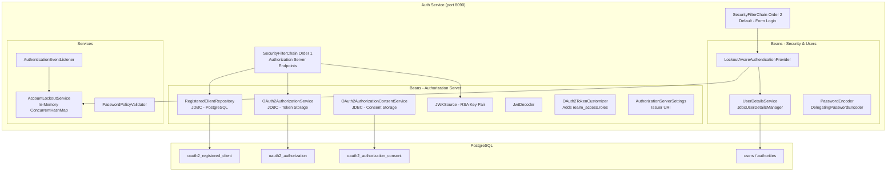
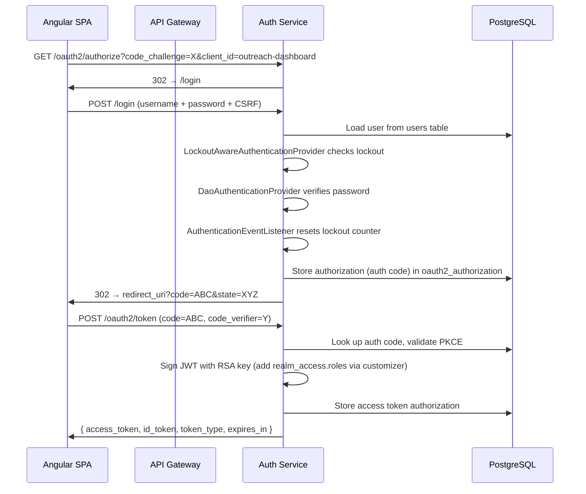
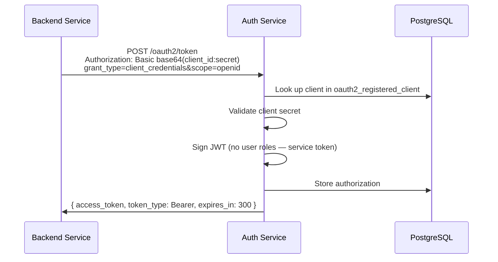
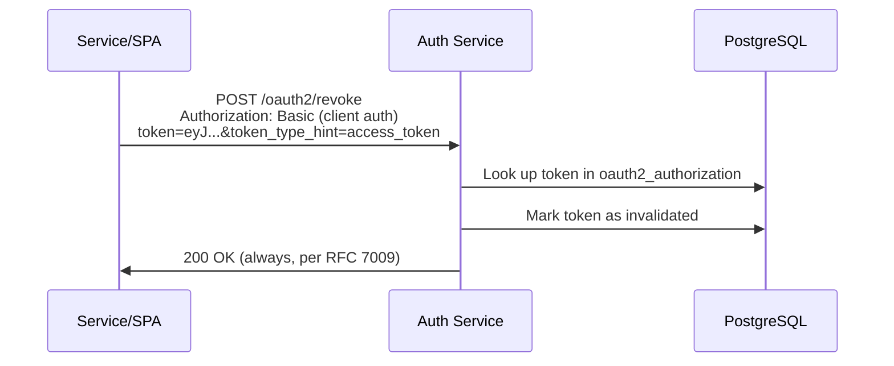

# Authorization Service

Embedded OAuth2/OIDC identity provider using Spring Authorization Server. This service issues JWT access tokens, refresh tokens, and ID tokens for the Outreach Platform. It serves as the **alternative** to Keycloak — only one provider is active at a time, controlled by the `idp.provider` property.

## Prerequisites

- Java 21+
- PostgreSQL 16+ (stores clients, authorizations, users)
- The `idp.provider=spring` property set (default in `application.yml`)

## How to Run

```bash
# From outreach-platform-parent root
.\mvnw.cmd spring-boot:run -pl auth-service

# Or standalone
cd auth-service
..\mvnw.cmd spring-boot:run
```

The server starts on **port 8090** by default.

---

## Architecture Overview



---

## Bean Registry — What Each Bean Does

### Filter Chain Layer (HTTP Security)

| Bean | Order | Role |
|------|-------|------|
| `authorizationServerSecurityFilterChain` | 1 | Handles all `/oauth2/*` endpoints (token, authorize, revoke, introspect, JWKS, OIDC discovery). Unauthenticated browser requests get redirected to `/login`. |
| `defaultSecurityFilterChain` | 2 | Handles everything else (form login page, actuator endpoints). Wires the `LockoutAwareAuthenticationProvider` for brute-force protection. |

### OAuth2 Authorization Server Beans

| Bean | Class | Persistence | Purpose |
|------|-------|-------------|---------|
| `registeredClientRepository` | `JdbcRegisteredClientRepository` | `oauth2_registered_client` table | Stores registered OAuth2 clients. Auto-provisions `outreach-dashboard` and `outreach-services` on first startup. |
| `authorizationService` | `JdbcOAuth2AuthorizationService` | `oauth2_authorization` table | Stores active authorizations (issued tokens, auth codes). Required for token revocation and introspection. Uses custom Jackson `ObjectMapper` with Security modules. |
| `authorizationConsentService` | `JdbcOAuth2AuthorizationConsentService` | `oauth2_authorization_consent` table | Stores user consent decisions for clients requesting scopes. |
| `authorizationServerSettings` | `AuthorizationServerSettings` | — | Declares the issuer URI (`http://localhost:8090`). Appears in the `iss` claim of all tokens. |
| `jwkSource` | `ImmutableJWKSet` (RSA 2048-bit) | In-memory | Provides the RSA key pair for signing JWTs. Exposed at `/oauth2/jwks` for resource servers to validate tokens. |
| `jwtDecoder` | `NimbusJwtDecoder` | — | Decodes/validates JWTs for the resource server endpoints within this service (e.g., UserInfo). |
| `jwtTokenCustomizer` | `OAuth2TokenCustomizer<JwtEncodingContext>` | — | Injects `realm_access.roles` claim into access tokens. Maps user authorities (`ROLE_ADMIN`, etc.) into the JWT payload for Keycloak-compatible role extraction. |

### Authentication & User Management Beans

| Bean | Class | Purpose |
|------|-------|---------|
| `userDetailsService` | `JdbcUserDetailsManager` | Loads user credentials from the `users`/`authorities` tables. Provisions default `admin` user on first startup. |
| `passwordEncoder` | `DelegatingPasswordEncoder` | Supports multiple encoding formats (`{bcrypt}`, `{noop}`). User passwords use bcrypt; client secrets use `{noop}` prefix. |
| `lockoutAwareAuthenticationProvider` | `LockoutAwareAuthenticationProvider` | Extends `DaoAuthenticationProvider`. Checks lockout status BEFORE authenticating. Throws `LockedException` if the account is locked. |

### Service Layer Beans

| Bean | Class | Purpose |
|------|-------|---------|
| `accountLockoutService` | `AccountLockoutService` | Tracks failed login attempts per username in a `ConcurrentHashMap`. Locks accounts after 5 failures for 30 minutes. |
| `passwordPolicyValidator` | `PasswordPolicyValidator` | Validates passwords against policy (12+ chars, uppercase, lowercase, digit, special char). |
| `authenticationEventListener` | `AuthenticationEventListener` | Listens for `AuthenticationFailureBadCredentialsEvent` (records failed attempt) and `AuthenticationSuccessEvent` (resets lockout counter). |

---

## Registered OAuth2 Clients

| Client ID | Type | Auth Method | Grant Types | Use Case |
|-----------|------|-------------|-------------|----------|
| `outreach-dashboard` | Public | `NONE` (PKCE required) | `authorization_code` | Angular SPA frontend. Uses PKCE (S256) for secure browser-based auth. No refresh tokens issued (public client security). |
| `outreach-services` | Confidential | `CLIENT_SECRET_BASIC` | `client_credentials` | Backend service-to-service calls. Secret sent via HTTP Basic header. |

---

## OAuth2 Endpoints Exposed

| Endpoint | Method | Purpose |
|----------|--------|---------|
| `/oauth2/authorize` | GET | Initiates Authorization Code + PKCE flow (redirects to login) |
| `/oauth2/token` | POST | Exchanges auth code or client credentials for tokens |
| `/oauth2/revoke` | POST | Revokes an access or refresh token (RFC 7009) |
| `/oauth2/introspect` | POST | Checks if a token is active (RFC 7662) |
| `/oauth2/jwks` | GET | Public RSA keys for JWT signature verification |
| `/.well-known/openid-configuration` | GET | OIDC Discovery document |
| `/userinfo` | GET | Returns authenticated user's profile claims |
| `/login` | GET/POST | Spring Security form login page |

---

## Authentication Flow Diagrams

### Authorization Code + PKCE (Dashboard)



### Client Credentials (Service-to-Service)



### Token Revocation



---

## IdP Switching Mechanism

The platform supports two identity providers. Only one is active at a time:

```
┌─────────────────────────────────────────────────────────────┐
│ idp.provider = spring                                        │
│                                                              │
│  Auth Service beans activate:                                │
│  - AuthorizationServerConfig (@ConditionalOnProperty)        │
│  - SecurityConfig (@ConditionalOnProperty)                   │
│  - AccountLockoutService (@ConditionalOnProperty)            │
│  - LockoutAwareAuthenticationProvider                        │
│  - PasswordPolicyValidator                                   │
│  - AuthenticationEventListener                               │
│                                                              │
│  Token issuer: http://localhost:8090                          │
│  JWKS: http://localhost:8090/oauth2/jwks                     │
└─────────────────────────────────────────────────────────────┘

┌─────────────────────────────────────────────────────────────┐
│ idp.provider = keycloak                                      │
│                                                              │
│  Auth Service beans DO NOT activate.                         │
│  Keycloak container handles all authentication.              │
│                                                              │
│  Token issuer: http://localhost:8080/realms/outreach         │
│  JWKS: http://localhost:8080/realms/outreach/protocol/       │
│        openid-connect/certs                                  │
└─────────────────────────────────────────────────────────────┘

Resource servers (Gateway, Event Service, etc.) always validate
tokens via: idp.jwks-uri — they don't care which provider issued them.
```

---

## Database Schema

The auth-service uses **Liquibase** to create its schema on startup. Two migration files:

### `20240101-001-oauth2-authorization-schema.sql`
- `oauth2_registered_client` — Stores client registrations (id, client_id, secret, grant types, scopes, settings)
- `oauth2_authorization` — Stores active tokens and authorization codes (supports revocation lookup)
- `oauth2_authorization_consent` — Stores user consent decisions

### `20240101-002-spring-security-users-schema.sql`
- `users` — Username, encoded password, enabled flag
- `authorities` — Username → granted authority mapping (ROLE_ADMIN, etc.)

---

## Configuration Reference

```yaml
# application.yml (key properties)
idp:
  provider: spring          # "spring" or "keycloak"
  jwks-uri: http://localhost:8090/oauth2/jwks

auth-server:
  issuer-uri: http://localhost:8090
  clients:
    dashboard:
      client-id: outreach-dashboard
      redirect-uri: http://localhost:4200/*
      post-logout-redirect-uri: http://localhost:4200/*
    services:
      client-id: outreach-services
      client-secret: CHANGE_ME_IN_PRODUCTION  # via env var in prod
  token:
    access-token-time-to-live: 5m
    refresh-token-time-to-live: 30m
    refresh-token-max-reuse: 0
  security:
    password-policy:
      min-length: 12
      require-uppercase: true
      require-lowercase: true
      require-digit: true
      require-special-char: true
    brute-force:
      max-failed-attempts: 5
      lock-duration: 30m
```

---

## Testing

```bash
# Run all auth-service tests (requires Docker for Testcontainers)
.\mvnw.cmd test -pl auth-service

# Run a specific test class
.\mvnw.cmd test -pl auth-service "-Dtest=ClientCredentialsFlowTest"
```

### Test Coverage

| Test Class | What It Validates |
|-----------|-------------------|
| `ClientCredentialsFlowTest` | Token issuance for confidential client, invalid credentials rejected |
| `AuthorizationCodePkceFlowTest` | Full PKCE flow (login → authorize → token exchange), JWKS endpoint |
| `TokenRefreshAndRevocationTest` | Token revocation (RFC 7009), introspection, idempotent revocation |
| `AccountLockoutIntegrationTest` | 5-attempt lockout, locked account rejection, reset on success |
| `PasswordPolicyIntegrationTest` | All policy rules (length, uppercase, lowercase, digit, special char) |
| `RoleBasedAccessControlTest` | ROLE_ADMIN/PMO/POC provisioned correctly, JWT contains roles |

---

## Key Design Decisions

| Decision | Rationale |
|----------|-----------|
| JDBC-backed (not in-memory) client/authorization storage | Survives restarts; required for multi-instance deployments and token revocation |
| Custom ObjectMapper on AuthorizationService | Fixes Jackson deserialization of `ImmutableCollections$Map1` in stored authorization attributes |
| In-memory lockout service (ConcurrentHashMap) | Simple for single-instance. Replace with Redis for clustered deployments |
| RSA key generated at startup | Fine for development. Production should load from a persistent keystore (JKS/PKCS12) or vault |
| `realm_access.roles` claim format | Keycloak compatibility — resource servers extract roles the same way regardless of provider |
| Public client gets no refresh tokens | Spring Authorization Server 1.4.x security policy: public clients cannot securely store refresh tokens |
